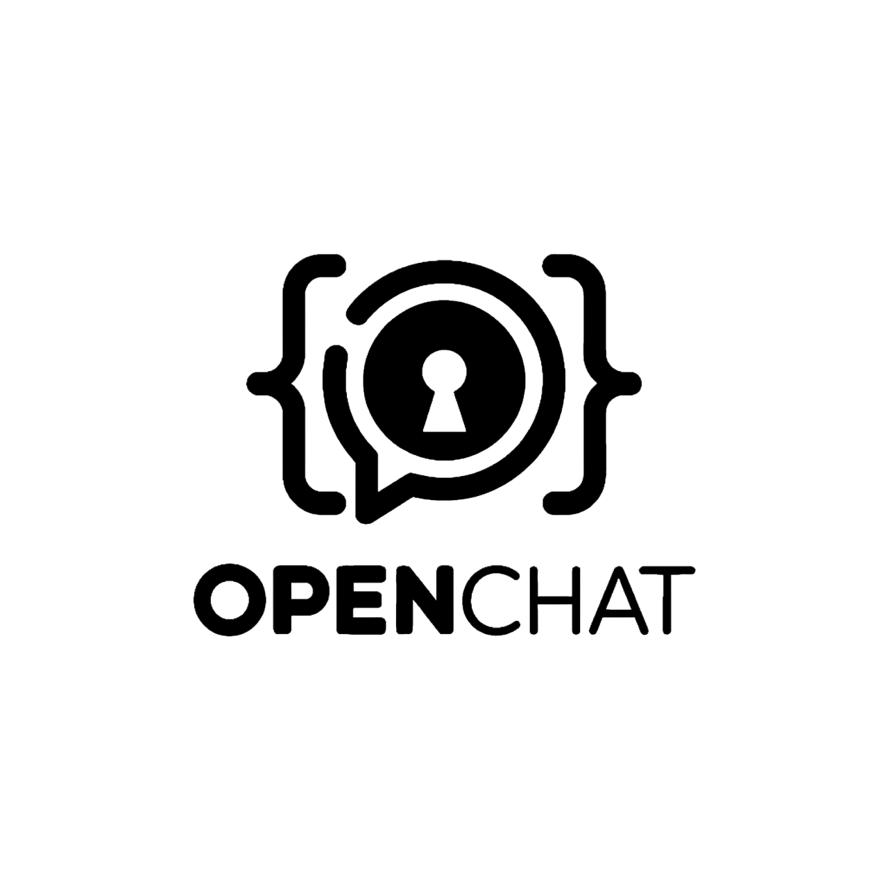

# OpenChat

<div align="center">
  
  <br>
  <strong>A secure, decentralized messaging platform</strong>
  <br>
  <br>

  [](https://railway.com/template/6zTNV1)
  
  
  
</div>

## 📋 Overview

OpenChat is a modern messaging application built with privacy and security at its core. Unlike traditional messaging platforms, OpenChat uses a decentralized architecture to ensure your conversations remain private, secure, and free from censorship.

### Key Features

- **End-to-End Encryption**: All messages are encrypted using state-of-the-art cryptographic algorithms
- **Decentralized Architecture**: No central servers to compromise or monitor your communications
- **Secure File Sharing**: Share files securely with BackBlaze B2 Cloud Storage integration
- **Push Notifications**: Real-time notifications using Web Push API with VAPID
- **Easy Deployment**: Deploy your own instance in minutes using our Railway template
- **Open Source**: Fully transparent codebase that anyone can inspect, modify, and contribute to

## 🚀 Quick Start

### Deploy Your Own Instance

The fastest way to get started is by deploying OpenChat on Railway:

1. Click the "Deploy on Railway" button at the top of this README
2. Sign in to your Railway account (or create one)
3. Configure your environment variables (see [Configuration](#-configuration) section below)
4. Click deploy and wait for the build to complete
5. Access your OpenChat instance via the provided URL

### Local Development

To run OpenChat locally for development:

```bash
# Clone the repository
git clone https://github.com/rpi10/openchatv2.git
cd openchatv2

# Install dependencies
npm install

# Set up environment variables
cp .env.example .env
# Edit the .env file with your configuration

# Start the development server
npm run dev
```

## 🛠️ Configuration

OpenChat requires the following environment variables:

| Variable | Description | Required |
|----------|-------------|----------|
| `NODE_ENV` | Environment (development/production) | Yes |
| `DATABASE_URL` | PostgreSQL database connection string | Yes |
| `DATABASE_PUBLIC_URL` | Public PostgreSQL connection URL | Yes |
| `SESSION_SECRET` | Secret key for session management | Yes |
| `B2_BUCKET_NAME` | BackBlaze B2 bucket name (e.g., ShareFilesOpenChat92) | Yes |
| `B2_BUCKET_ID` | BackBlaze B2 bucket ID | Yes |
| `B2_BUCKET_URL` | BackBlaze B2 bucket URL | Yes |
| `B2_APPLICATION_KEY` | BackBlaze B2 application key | Yes |
| `VAPID_PUBLIC_KEY` | Public VAPID key for Web Push notifications | Yes |
| `VAPID_PRIVATE_KEY` | Private VAPID key for Web Push notifications | Yes |
| `GROQ_API_KEY` | API key for Groq AI integration | Yes |

## 🏗️ Architecture

OpenChat uses a decentralized architecture to ensure privacy and security:

1. **Client-Side Encryption**: All message content is encrypted on the sender's device before transmission
2. **Secure Storage**: Files are encrypted and stored in BackBlaze B2 Cloud Storage
3. **Push Notifications**: Real-time updates using Web Push API with VAPID authentication
4. **PostgreSQL Database**: For managing user data and encrypted message metadata
5. **AI Integration**: Optional Groq AI integration for enhanced features

## 📁 Project Structure

```
openchatv2/
├── client/              # Frontend application
├── server/              # Backend server
│   ├── controllers/     # Request handlers
│   ├── models/          # Data models
│   ├── routes/          # API routes
│   └── services/        # Business logic
├── shared/              # Shared utilities and types
├── migrations/          # Database migrations
├── scripts/             # Utility scripts
└── tests/               # Test suite
```

## 🔐 Security

OpenChat implements several security measures:

- End-to-end encryption for all messages
- Secure file handling with encrypted storage in BackBlaze B2
- Session management with secure cookies
- VAPID authentication for Web Push notifications
- Environment variables for sensitive configuration

Found a security vulnerability? Please do not create a public issue. Instead, send a private message to the repository owner.

## 🤝 Contributing

Contributions are welcome! Please feel free to submit a Pull Request.

1. Fork the repository
2. Create your feature branch (`git checkout -b feature/amazing-feature`)
3. Commit your changes (`git commit -m 'Add some amazing feature'`)
4. Push to the branch (`git push origin feature/amazing-feature`)
5. Open a Pull Request

## 📝 License

This project is licensed under the MIT License - see the [LICENSE](LICENSE) file for details.

## 📞 Contact

- GitHub: [@rpi10](https://github.com/rpi10)
- Repository: [https://github.com/rpi10/openchatv2](https://github.com/rpi10/openchatv2)
- Issues: [https://github.com/rpi10/openchatv2/issues](https://github.com/rpi10/openchatv2/issues)
